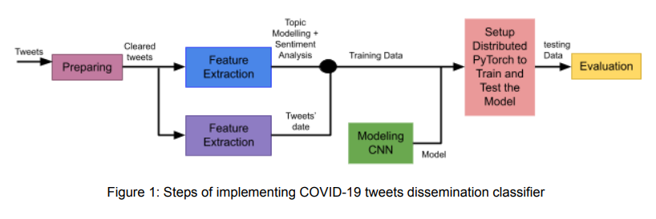
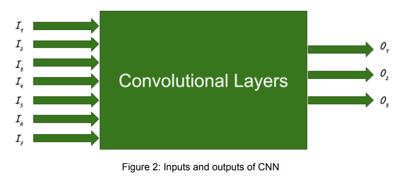
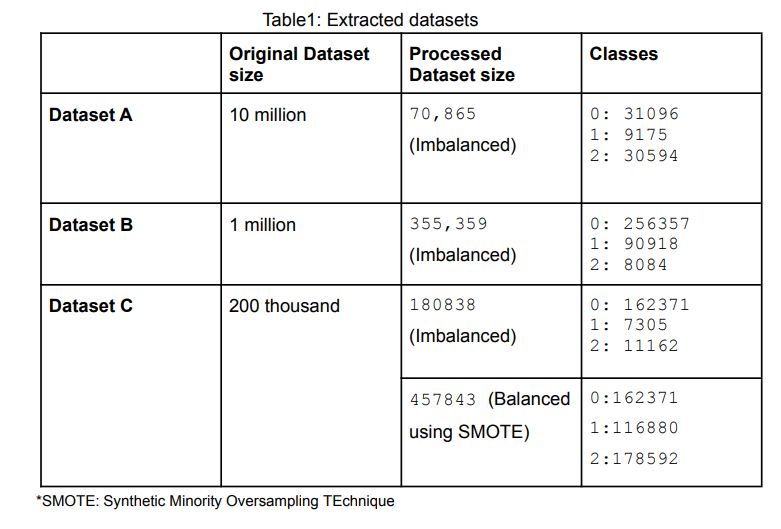
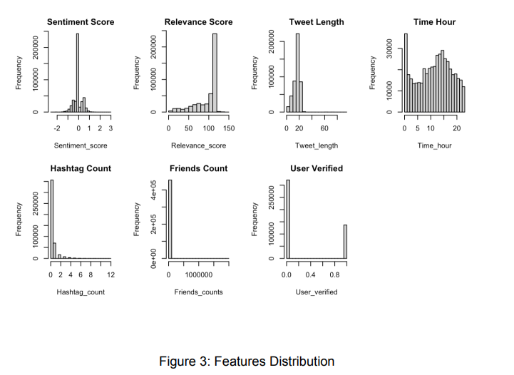
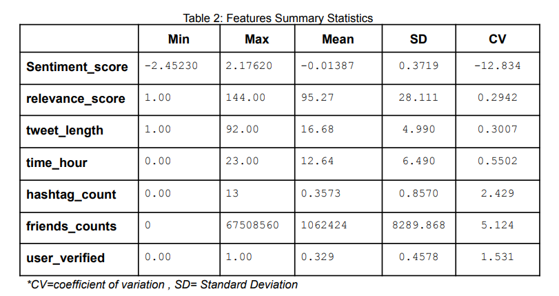
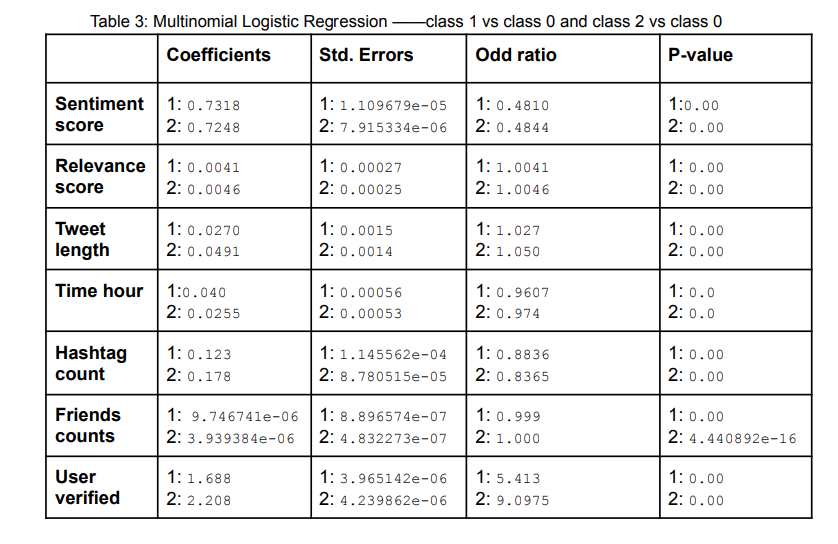
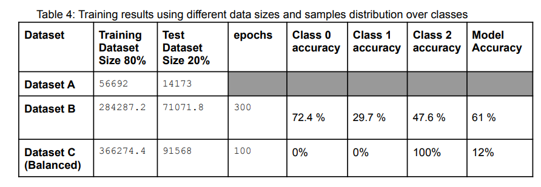
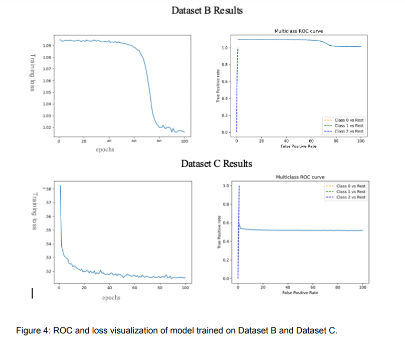

# Covid Twitter Misinformation
Social media plays an important role to inform people from their surrounding
environment. Twitter is a very well-known media. It enables people to use hashtag
symbols (#) to link to all of the other tweets that are talking about the same topic. The
most used hashtagged words mostly identify the trending topics worldwide [1]. People
around the world sometimes start a Twitterstorm which is a sudden spike to bring a
trendy hashtag. Doing so, they can gain the attention of people to achieve political,
social, economical or other goals. The most significant tool to make a hashtag popular
is reusing a hashtag by subsequent retweets and tweets [2]. So, planners are
supposed to acquire strategies in order to get their audience noticed from their favourite
subjects. These strategis illustrate the features that define how fast a hashtag can
spread through the media. These features can vary from a topic to another topic. For
instance, although political hashtags can be trending if some powerful leaders mention
them, sport related hashtags can depend on the date in a year more than the popularity
of people who retweet or create the hashtag.
Covid19 is a new strain of Coronavirus which is an infectious disease with an
unbelievable difference compared to previous types; It has given rise to a worldwide
pandemic which has affected more than 121 million people and caused 2,679,747
deaths so far. Hence,the most common trendy topics this time are those that are related
to COVID-19 since social network platforms tremendously contribute to transforming
COVID-19 information. Health agencies’ staff demand to use the most effective
resources to increase the speed of dissemination of true news and information about
Covid-19 and conversely decrease the rate of misleading news. Nevertheless, with the
appearance of the Corona virus which has characteristics not known yet, and also with
fear among the public, the spread of fake information about the virus and its impact are
massively appearing. For instance, “Covid-19 is a lie” climbed the trending ranks of
Twitter and cracked the top 5 in California because the anti-science movement is more
influential than a fact expressed by scientific and health authorities. [3]
Therefore, we are aiming to predict the effectiveness of a tweet by classifying the tweets
to three different categories (unpopular, regular, popular tweet) based on the probable
number of retweets which a Covid-19 tweet in Twitter specificely can obtain. We have
this knowledge that these critical factors of tweets’ dissemination could be 1) the usual
number of retweets for the user who at first publishes that tweet, 2) social level of
publishers (usual user or famous person), 3) sentiment analysis score, 4) length of
tweet message, 5) the number of hashtags at that tweet text, 6) the time, day and year
that message is posted, 7) to what extent the tweet is relevant to Covid-19 topic.
When introducing a dissemination classifier model, there will be different parties that
benefit from this system. This tool could help governors to find the efficient ways to
diffuse true Covid-19 information to increase people’s awareness. Also, it provides a
precious opportunity for psychologists, sociologists, and epidemiologists to analyze the
behaviour of people like the research is performed in [4]. In addition, this model will be
capable to show the readers the level of tweets popularity as a byproduct which could
assist the public to reveal the reason of popularity of the tweets and know if they can
trust those tweets or not. This will increase the confidence of citizens in their
governments, refuse all information that is published about fake products or
vaccinations which might negatively affect people's health, reject all death news that
raise the people’s fear and lead to stop some unpreferable behaviors, such as
over-purchasing and stockpiling of toilet paper from groceries, which might affect
countries’ economy.
Last but not least, this challenge is considered as Big Data problem since 1) the data
that will be used is very large dataset, which contains 152 millions of tweets [5] 2) the
challenge needs long time to train the network on this dataset to classify the tweets to
different levels of popularity classes and 3) distributed and parallel deep learning
approach is needed to increase the efficiency and performance of the classifier.

## Framework
PyTorch framework: We will implement the training model by distributed PyTorch
framework by Python language. The reason we prefer PyTorch rather than TensorFlow
is that using PyTorch makes us capable to debug and locate the source of error quitely
trouble-free. The distributed PyTorch deployed GLOO as its communication
backendand and up to 8 number of workers. Also, we implemented n-gram architecture
for the Neural Network training.
Preprocessing: We will use NLTK library to apply most of the processing steps such
as, removing stopwords, links, symbols,etc. You can see §3.1 for more details.
Feature extraction- Sentiment analysis: There are many NLP toolkits that provide
sentiment analyzers like CoreNLP. What we will start with in this project is NLTK which
already has a built-in, trained sentiment analyzer called VADER (Valence Aware
Dictionary and sEntiment Reasoner). Polarity_scores() algorithm provides three
sentiment scores, negative, neutral, and positive numerical scores. Feature extraction- Topic modelling technique: There are different techniques to
extract trending topics in a document. One of them is Latent Dirichlet Allocation (LDA)
[6], which provides a probability distribution for each topic over the words in a
document. However, it provides a low performance when working over short texts due
to the lack of word co-occurrence information. The one we used is the frequency
distribution algorithm, which provides how many times each COVID-19 related word
appears within a given text. COVID-19 dictionary is built to look up for all related words.
Spelling Auto Correction There are some errors in the language noticed used in
casual English and found in social media. These irregular language errors can be
grouped into several categories: 1) Abbreviation: e.g., (“saying”); 2)
misspellingExamples: e.g.,wouls (would), 3) Punctuation error like in im (“I’m”), 4)
Wordplay, like soooooo great. This hinders the ability of extracting the topic relevance,
sentiment and so on so forth, therefore, we spent time on finding libraries that correct
the language in an efficient way. One of these libraries is textblob which is used in this
project to autocorrect tweets before extracting all required features.
Feature extraction-Twitter dependency: We exploited the Twitter application API for
developers to hydrate the Tweets by their IDs. Unfortunately, we don’t have any canned
data. So, we faced a lot of challenges to get metadata of tweets in our journey. As a
matter of fact, when we use “api.statuses_lookup(id_batch)” to fetch the tweets, up to
100 IDs are allowed to send in each batch. In addition, sleep time is needed to prevent
hitting the API rate limit. It means, we cannot send any number of requests to Twitter
API. We need 6s sleep after each request. So, it took an unimaginable long time to
obtain, especially when the amount of servers’’ traffic was high.

## Strategy
For building a Covid-19 tweets dissemination classifier system, distributed machine
learning models are considered to handle this challenge. To be specific, there will be
four steps that should be passed through to deploy this system—data preprocessing,
feature selection, machine learning model selection and implementation, and finally
setup and train and test the model on parallelized clusters.

### Data Preparing and Clearing
For the purpose of extracting features of COVID19 tweets, the following steps
must be considered:
- Tokenization and sentences splitting: this is performed for further textual
processing.
- Data Cleaning: removing all non English alphabets, numbers, emojis, and
symbols
- Stop words removal: since it accounts for a large part of natural language
text and they do not provide any benefits for the analysis, they will be
removed. The size of the data will be definitely much less than the original
one.
- Spelling correction to increase the effectiveness of extracting features like
topic relevance and sentiment.
### Feature Extracting and Pre-processing
We explored the COVID-19 Twitter chatter dataset to extract the required
features for inputs in order to start CNN training. On one hand, the main features
that extracted from the tweets inputs are: 1) popularity of the each tweet creator;
2) the number of retweets that creators usually get for their own tweets, 3)
sentiment analysis score which identifies indicates that tweet carry negative or
positive content, 4) tweet’s length, 5) publish time of the tweet, and 6) number of
hashtags that are used in a tweet, 7) how extent it pertains to Covid-19, 8)
number of retweets to be labels of tweets to represent their dissemination. We
used all processing code that is provided by [5] to hydrate the tweet and extract
all required tweets information.
### Feature Normalization
We must have normalized each feature to be in a range of zero and one,
because the large values of some features can make the other small features
ineffective. So, we simply tune them to be between zero and one regarding their
own maximum and minimum.
### CNN model training
In this phase, we modeled 2- and 3-layers CNNs and an n-gram(n=2,3,4)
architecture. They were trained by back-propagation gradients to decrease the
cross entropy loss. They used the processed data as shown in the figure2. 
I1: the user is verified or not, 
I2: the number of followers that creator has, 
I3: sentiment analysis score, 
I4: length of tweet messages, 
I5: number of hashtags at the message, 
I6: time of posting of the message, 
I7: relevance to Covid-19 topic.
O1: no time is reshared (Unpopular), 
O2: between 1 to 20 times it is retweeted (regular), 
O3: more than 20 times it is propagated and can be a popular tweet.

### Setup Distributed PyTorch
We need distributed Pytorch in 2 different parts of our implementation. First, we
exploited “all-gather” of the hydrated tweets to collect all features.This step was
very time-consuming and for this large amount of data was impossible if we didn't
utilize distribution. Second, we applied distribution to the Stochastic gradient
descent (SGD) optimizer. It utilized “all-reduce” to get the average of gradients.
Also, we used both constant and adaptive learning rate but adaptive learning rate
was not comparable since it needs more epochs and we did not have enough
time.

### The dataset
We utilize an open-source and large-scale COVID-19 Twitter chatter dataset that
contains 152 million tweets and grows daily. They are gathering this significant
dataset by filtering tweets which contains the related words to Covid-19 such as
following keywords: "coronavirus", "wuhan", "pneumonia", "pneumonie",
"neumonia", "lungenentzündung", "covid19". They also are collecting from
various languages including English, French, Spanish, and German, Russian,
and so forth. We need to use a clean version which removes the retweets [5].
The number of English tweets is around 60 millions. For time constraints, we
extracted 3 different sizes from this big data as shown in Table 1. All extracted
data was imbalanced, therefore, one of these data (Data C) is oversampled to
explore the impact among sizes and samples distribution over classes on model
accuracy.

## Results and Analysis
In this section we provide the results and analysis of features impact on tweets
dissemination and data size impact on model performance. As our solution is multi
classification, we have a large set of metrics we can use. We split the data into 80%
training and 20% testing sets. In terms of evaluation metrics, since each metric has
limitations, we want to evaluate the classifier’s performance from different perspectives;
therefore, accuracy, cross entropy loss, ROC curve (True Positive Rate and False
Positive Rate).

### Features Results and Analysis
RQ: What is the effect of sentiment analysis, relevance score, weet_length ime_hour,
user.verified on dissemination of the tweet?

As we mentioned earlier, sentiment analysis, topic relevance, tweet length, time hour,
hashtag count, friend count and user popularity are expected to impact the
dissemination of tweets.Here, our aim is to test whether these features play a noticeable
role in disseminating tweets. To evaluate the effect of these features, multinomial
logistic regression is applied on Dataset C since three nominal classes [0= not
popular,1=regular,2=popular] is considered in our solution and, as shown in Figure 3, all
features are not normally distributed. We chose Dataset C since it is balanced and
large.
In terms of variation, we noticed that the variation of features, as shown in table 1, is
considered low. In Sentiment scores, for instance, the coefficient of variation is -12.834
which is extremely low. The variation of other features however is slightly better than
that of Sentiment scores as in friend count (CV= 5.124) — as a rule of thumb, if CV
greater than 1, the feature datapoints are variant. Moreover, there is a good point about
the data that the means of features represent the entire COVID-19 tweets population
based on the results of standard errors in Table 2. These standard errors are
considerably low which means these samples could represent the entire tweets
population.

In terms of features impact on the popularity of such tweets, we found from logistic
regression results that all features have significant effect on the dissemination of
COVID-19 tweets as p > 0.05, as shown in Table 3. One of the most effective features is
user popularity, which has higher influence on popularity vs non-popularity by around
2.208. Moreover, the probability that (odd ratio) the dissemination of tweets in the
classes (1 and 2) are influenced by these features is greater than their impact on tweets
in unpopular (class 0), which is considered as baseline to compare with since our focus
on popular tweets. All three datasets have the same results as this dataset. However,
they are not listed here for the time and space constraints.

### Model Results and Analysis
RQ: What is the effect of two different sizes of data on the accuracy of classification
Results
The model is trained on only two of our datasets because of time constraints. As noticed
in Table 4, when trained on Dataset B with 284287 samples of training data and 71071
samples of testing data, the model accuracy was 61%, specifically, class 0 accuracy
was 72.4 % and it is reasonable since the number of unpopular tweets is the largest in
Dataset B , class 1 accuracy was 29.7 %, and class 2 accuracy was 47.6 % even
thought the number tweets in class 1 (90918 samples) is much greater than that in class
2 (8084 samples). We use weights for cross entropy loss to compensate for the
imbalance data.
On the other hand, when trained on Dataset C with 366274 samples of training data and
91568 samples of testing data, the model accuracy was 12%, specifically, class 0
accuracy was 0 % , class 1 accuracy was 0 %, and class 2 accuracy was 12 % even
though there are enough numbers of samples in all classes number, however the
learning rate was constant and the number of epoch were not enough to learn from the
dataset.

To visualize how well our classifier is performing, the cross entropy loss, ROC curve are
considered as shown in figure 4.a, 4.b, 4.c, and 4.d. For Dataset C, the loss is
decreasing over time and it is positive point, however, if we dig into all classes results
using ROC curve, we found that there might be overfitting is caused — we applied
oversampling technique to tackle balancing issue and increase the data samples,
however, it results with making class 2 dominant. As noticed in figure 4, the rate of true
positive of class 2 is high, however, the true positive rate for class 1 and 0 is 0. This is
definitely caused because we did not provide the model with enough time to learn — the
epochs were only 100.
All in all, we could not conclude that the size does not contribute to the accuracy of the
model since the hyperparameters like epochs are not perfectly specified. The training
time for the model to learn from the data was not enough to get the exact results.
However, as we see the results of model when trained over Dataset B gain better
results relatively to Dataset C since the training time was larger than that when training
on Dataset C. therefore, with the large dataset and more epoches, it is expected to
achieve higher accuracy.

### Future works
First, we will need more feature engineering to be able to predict viral tweets because
they are rare in big data like looking for a needle in a haystack. Second, we need to
consider other parameters for tweet dissemination such as the number of likes or
quotes and so on.

## References

[1] How to use hashtags. (n.d.). Retrieved March 29, 2021, from
https://help.twitter.com/en/using-twitter/how-to-use-hashtags#:~:text=People%20use%2
0the%20hashtag%20symbol,included%20anywhere%20in%20a%20Tweet
[2] Techopedia. (2013, December 13). What is a twitterstorm? - definition from
Techopedia. Retrieved March 29, 2021, from
https://www.techopedia.com/definition/29624/twitterstorm#:~:text=A%20Twitterstorm%2
0is%20a%20sudden,news%20or%20a%20controversial%20debate.
[3] Oremus, W. (2020, April 22). The absurd Reason 'Covid-19 is a Lie' ended up
trending on Twitter. Retrieved March 29, 2021, from
https://onezero.medium.com/the-absurd-reason-covid-19-is-a-lie-ended-up-trending-ontwitter-3943b978287c
[4] Kamiński, M., Szymańska, C. and Nowak, J.K., 2021. Whose Tweets on COVID-19
Gain the Most Attention: Celebrities, Political, or Scientific Authorities?.
Cyberpsychology, Behavior, and Social Networking, 24(2), pp.123-128.
[5] Banda, Juan M., et al. "A large-scale COVID-19 Twitter chatter dataset for open
scientific research--an international collaboration." arXiv preprint arXiv:2004.03688
(2020).
[6] Blei D.M., Ng A.Y., Jordan M.I. Latent Dirichlet allocation. J. Mach. Learn. Res.
2003;3:993–1022.
